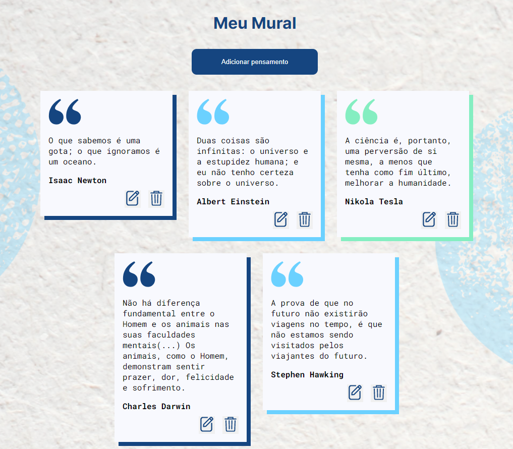

<h1 align="center">
    
</h1>

<h1 align="center">
    
</h1>

# Índice

- [Sobre](#-sobre)
- [Tecnologias utilizadas](#-tecnologias-utilizadas)

## 🔖 Sobre

Aplicação responsável por salvar anotações.

---

## 💻 Tecnologias utilizadas

O projeto foi desenvolvido utilizando as seguintes tecnologias:

- [Angular](https://angular.io)
- [HTML](https://developer.mozilla.org/pt-BR/docs/Web/HTML)
- [CSS](https://developer.mozilla.org/pt-BR/docs/Web/CSS)
- [TypeScript](https://www.typescriptlang.org)

---

<h3 align="center">
  Feito com ❤️ por Leonardo Santana
</h3>
